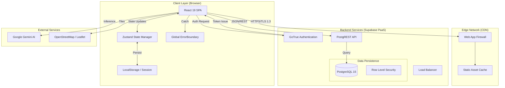

# Present Technical Architecture (Live System)
**Project:** District Skill Development Dashboard (Dakshina Kannada)
**Date:** February 6, 2026
**Status:** Production Ready

## 1. Executive Summary
This document outlines the **current, active architecture** of the KSDC Platform. It reflects the code that is deployed and running in the present codebase.

## 2. System Architecture

The system operates as a **Component-Based Single Page Application (SPA)** leveraging Supabase as a Backend-as-a-Service (BaaS). It follows a standard **Request-Response** pattern for data operations.

### Architecture Diagram



## 3. Technology Stack

### Frontend Core
- **Framework:** React 19.0.0
- **Build System:** Vite 7.2.4
- **Language:** TypeScript 5.9
- **State:** Zustand 5.0.9
- **Routing:** React Router DOM (Client-side)
- **Forms:** React `useState` (Controlled Components)

### Backend & Infrastructure (Supabase)
- **Database:** PostgreSQL 15
- **API:** PostgREST (Auto-generated)
- **Auth:** Supabase GoTrue (JWT-based)

### AI & Intelligence
- **Model:** Google Gemini 1.5 Flash
- **Integration:** `@google/genai` SDK
- **Features:** Intelligent JSON Parsing, Tool Use (Search/Maps)

## 4. Key Component Implementations

### 4.1 AI Service (`geminiService.ts`)
-   **Implementation:** Direct SDK call with `systemInstruction` for structured output.
-   **Strict Mode:** Uses JSON Schema validation to ensure AI responses match UI types exactly.

### 4.2 Interactive Maps (`MapView.tsx`)
-   **Engine:** React-Leaflet v5.
-   **Optimization:** Custom `divIcon` markers instead of heavy png assets.
-   **Visualization:** `leaflet.heat` plugin for density mapping.

### 4.3 Resilience (`ErrorBoundary.tsx`)
-   **Strategy:** Global catch-all boundary wrapping the `App` component.
-   **Fallback:** User-friendly error UI with reload capability.

## 5. Security Strategy

-   **Zero Trust:** Application assumes no network trust.
-   **RLS (Row Level Security):** Database policies strictly enforce data ownership.
    -   *Example:* `auth.uid() = owner_id`
-   **Encryption:** 
    -   AES-256 for Data at Rest.
    -   TLS 1.3 for Data in Transit.

## 6. Project Structure

```
src/
├── components/          # React Components
│   ├── _common/         # Reusable UI (Buttons, Inputs)
│   ├── business/        # Business Logic Components
│   ├── layout/          # Sidebar, Header
│   ├── map/             # MapView, Heatmap
│   └── entry/           # Data Entry Forms (No Zod)
├── features/            # Feature-specific logic
├── lib/                 # Utilities
├── services/            # API & AI Services
└── store/               # Zustand Stores (auth, data)
```

## 7. Performance Optimizations

1.  **Split Chunking:** Vendor libraries (Leaflet, Recharts) split into separate chunks via `vite.config.ts`.
2.  **Asset Caching:** Immutable cache headers for built assets.
3.  **Atomic State:** Zustand selectors prevent unnecessary re-renders.

## 8. Scalability

-   **Frontend:** Scales infinitely via CDN.
-   **Backend:** Managed PaaS (Supabase) with auto-scaling capabilities.
