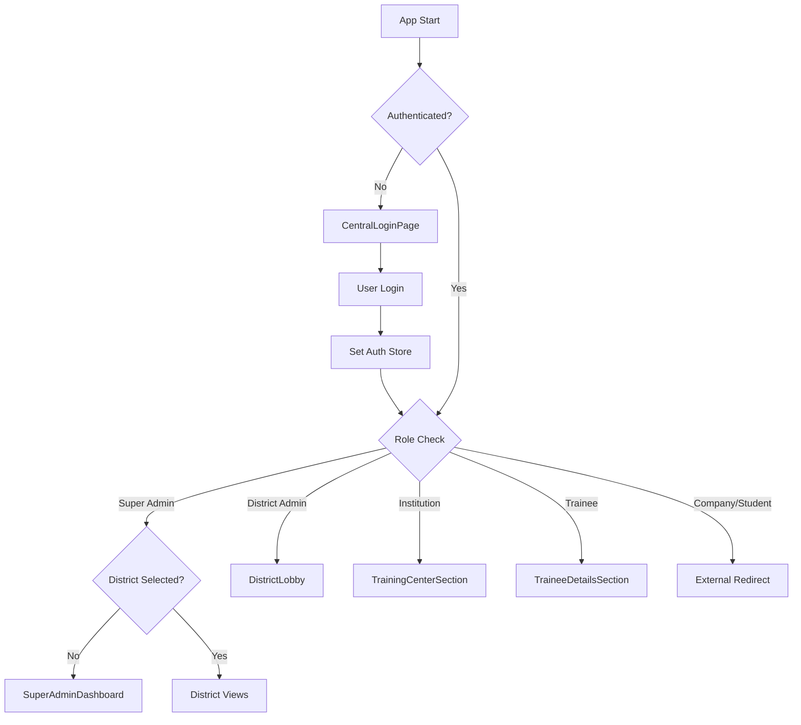
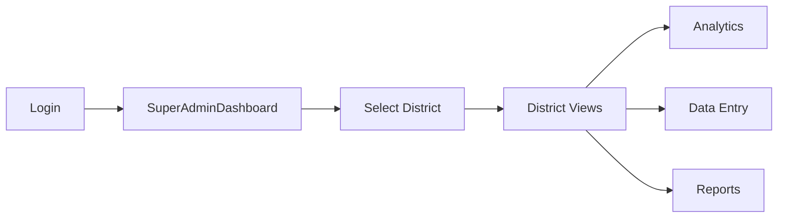
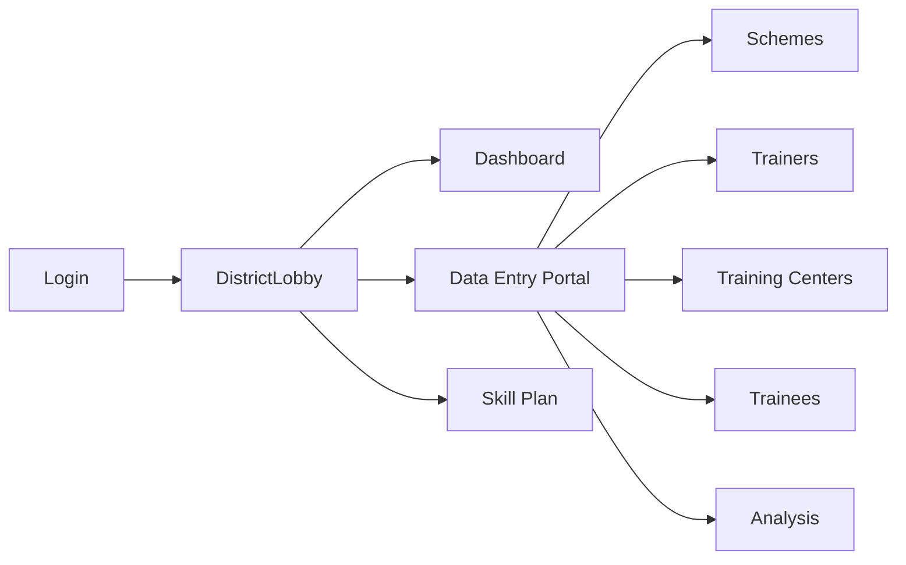
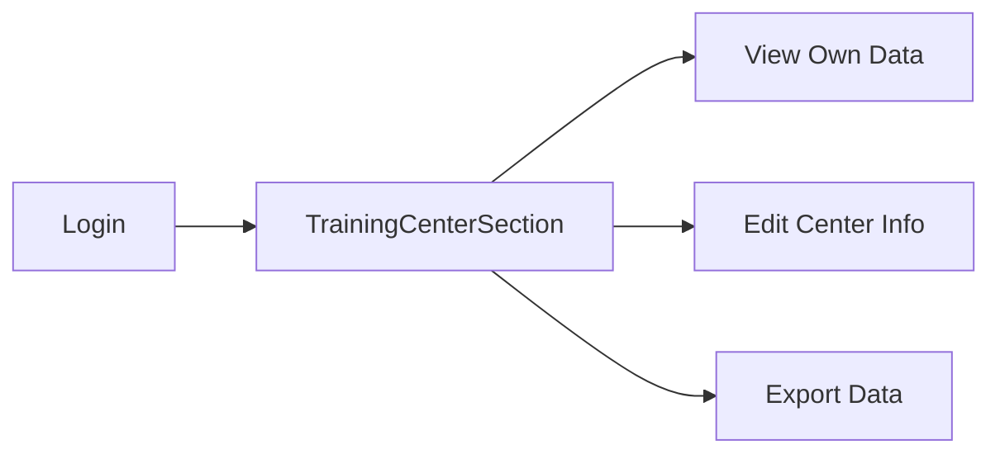
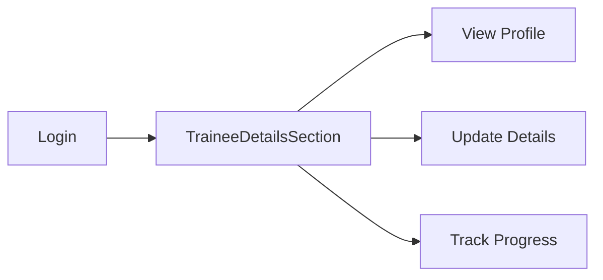
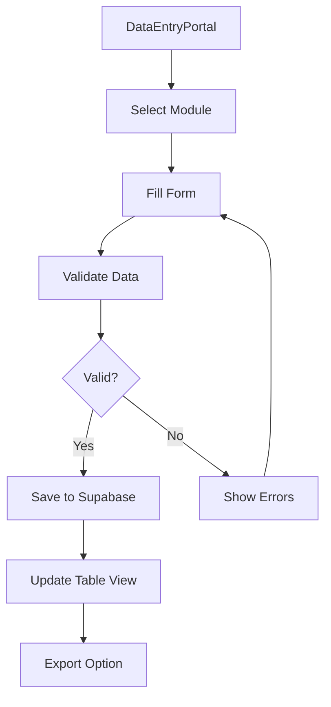

# Software Architecture Documentation
## Karnataka Skill Development Corporation Platform

---

## Table of Contents

1. [System Overview](#system-overview)
2. [Technology Stack](#technology-stack)
3. [Architecture Patterns](#architecture-patterns)
4. [Authentication & Authorization](#authentication--authorization)
5. [Application Structure](#application-structure)
6. [Page Hierarchy & Navigation](#page-hierarchy--navigation)
7. [Core Components](#core-components)
8. [Data Models & Schemas](#data-models--schemas)
9. [State Management](#state-management)
10. [API & Backend Integration](#api--backend-integration)
11. [Key User Flows](#key-user-flows)
12. [Module Breakdown](#module-breakdown)

---

## System Overview

The **Karnataka Skill Development Corporation (KSDC) Platform** is a comprehensive district-level skill development management system designed for Karnataka state. It provides multi-role access for administrators, institutions, trainees, and companies to manage, analyze, and visualize skill development data across 31 districts.

### Primary Objectives

- **District-level skill gap analysis** and workforce planning
- **Data entry and management** for institutions, training centers, trainees, and schemes
- **Analytics and visualization** of training outcomes, placements, and industry demand
- **AI-powered insights** for skill forecasting and recommendations
- **Multi-stakeholder collaboration** between government, institutions, and industry


> [!NOTE]
> Please replace `screenshots/dashboard_overview.png` with an actual screenshot of the main dashboard.

---

## Technology Stack

### Frontend
- **Framework**: React 19.2.0 with TypeScript
- **Build Tool**: Vite 7.2.4
- **Routing**: React Router DOM 7.13.0
- **Styling**: Tailwind CSS 4.1.17
- **UI Components**: Custom components with Lucide React icons

### State Management
- **Zustand 5.0.9**: Global state management with persistence
  - `useAuthStore`: Authentication and user session
  - `useDataStore`: Institution and application data

### Data Visualization
- **Recharts 3.5.1**: Charts and graphs
- **React Force Graph 2D**: Network visualizations
- **React Leaflet 5.0.0**: Interactive maps with heatmaps
- **Leaflet.heat**: Heatmap overlays

### Backend & Database
- **Supabase**: PostgreSQL database with real-time capabilities
- **@supabase/supabase-js 2.93.2**: Database client

### AI & Analytics
- **Google Generative AI (@google/generative-ai 0.24.1)**: AI-powered insights and forecasting
- **Custom forecasting engine**: Scenario analysis and demand projection

### Data Processing
- **PapaParse 5.5.3**: CSV import/export functionality
- **@tanstack/react-table 8.21.3**: Advanced table management
- **date-fns 4.1.0**: Date manipulation

---

## Architecture Patterns

### 1. **Component-Based Architecture**
- Modular, reusable components organized by feature
- Clear separation between presentational and container components
- Shared UI components in `/components/ui`

### 2. **Feature-Based Organization**
```
src/
├── components/
│   ├── auth/           # Authentication pages
│   ├── pages/          # Main page components
│   ├── dashboard/      # Dashboard modules
│   ├── entry/          # Data entry forms
│   ├── map/            # Map visualizations
│   └── ui/             # Reusable UI components
├── lib/                # Business logic & utilities
├── store/              # State management
├── data/               # Static data & SQL schemas
└── types/              # TypeScript definitions
```

### 3. **State Management Pattern**
- **Zustand stores** for global state (auth, data)
- **Local state** (useState) for component-specific UI state
- **Persistent storage** for authentication sessions

### 4. **Data Flow Pattern**
```
User Input → Component → Supabase Client → PostgreSQL
                ↓
         Local State Update
                ↓
         UI Re-render
```

---

## Authentication & Authorization

### User Roles

| Role | Access Level | Primary Views |
|------|-------------|---------------|
| **Super Admin** | All districts | District selection dashboard, full analytics |
| **District Admin** | Single district | District lobby, data entry portal, analytics |
| **Institution** | Own institution data | Training center management |
| **Trainee** | Own trainee data | Trainee details form |
| **Company** | Company portal | External redirect to InPulse platform |
| **Guest** | Read-only | Limited dashboard access |

### Authentication Flow



### Auth Store Structure
```typescript
interface AuthState {
    user: User | null;
    isAuthenticated: boolean;
    currentDistrict: string | null;
    login: (user: User) => void;
    logout: () => void;
    setDistrict: (district: string | null) => void;
}
```

---

## Application Structure

### Main App Component ([App.tsx](file:///d:/dk%20district/dk-directory/src/App.tsx))

The root component manages:
- **Authentication guards** (lines 106-132)
- **Role-based routing** (lines 129-308)
- **View state management** (lines 59-60)
- **Map integration** (lines 470-559)
- **Mobile responsiveness** (lines 407-423)

### View State Machine

```typescript
// Main Views
type CurrentView = 'map' | 'dashboard' | 'eee-overview' | 'institutions' 
  | 'assessments' | 'industry' | 'coe' | 'centers' | 'ai-search' 
  | 'reports' | 'analytics' | 'forecast' | 'skills-intel'

// Admin Modes
type AdminMode = 'lobby' | 'dashboard' | 'portal' | 'plan' | 'plan-list' 
  | 'plan-edit' | 'schemes' | 'trainer' | 'iti-trade' | 'training-center' 
  | 'trainee-details' | 'trainee-analysis' | 'district-skill-matrix'
```

---

## Page Hierarchy & Navigation

### 1. **Authentication Layer**

#### [CentralLoginPage](file:///d:/dk%20district/dk-directory/src/components/auth/CentralLoginPage.tsx)
- Entry point for all users
- Role selection and credential entry
- Redirects based on user role

#### [SuperAdminDashboard](file:///d:/dk%20district/dk-directory/src/components/pages/SuperAdminDashboard.tsx)
- District selection interface (31 Karnataka districts)
- Overview metrics across all districts
- Navigation to specific district dashboards

---

### 2. **District Admin Flow**

#### [DistrictLobby](file:///d:/dk%20district/dk-directory/src/components/pages/DistrictLobby.tsx)
Main navigation hub with options:
- **Dashboard** → District analytics
- **Data Entry Portal** → Form-based data management
- **District Skill Plan** → Strategic planning tools
- **Analytics** → Advanced reporting

#### [DataEntryPortal](file:///d:/dk%20district/dk-directory/src/components/pages/DataEntryPortal.tsx)
Central data management interface with cards for:
- Institution Entry
- Company Entry
- Center of Excellence (CoE) Entry
- Schemes Management
- Trainer Management
- ITI Trade Management
- Training Center Management
- Trainee Details
- Trainee Data Analysis
- Trainee Data Analysis
- District Skill Matrix


> [!NOTE]
> Please replace `screenshots/data_entry_portal.png` with an actual screenshot of the data entry portal.

---

### 3. **Main Dashboard Views**

#### [DistrictDashboard](file:///d:/dk%20district/dk-directory/src/components/pages/DistrictDashboard.tsx)
Primary analytics dashboard with tabs:
- **Overview**: Key metrics and KPIs
- **Supply Analysis**: Educational institutions and capacity
- **Demand Analysis**: Industry requirements
- **Gap Analysis**: Supply-demand mismatch
- **Forecasting**: AI-powered projections
- **Recommendations**: Actionable insights

**Key Features:**
- Interactive charts (Recharts)
- Drill-down navigation
- Export capabilities
- Real-time data updates

#### [DKEducationDashboard](file:///d:/dk%20district/dk-directory/src/components/dashboard/DKEducationDashboard.tsx)
Comprehensive education analytics with tabs:
- **Overview**: District-wide education metrics
- **Institutions**: Detailed institution analysis
- **Programs**: Course and program breakdown
- **Placements**: Placement trends and statistics
- **Skills**: Skill gap analysis
- **Industry**: Industry demand mapping
- **CoE**: Center of Excellence performance
- **Forecasting**: Predictive analytics

---

### 4. **Specialized Views**

#### [EEEOverview](file:///d:/dk%20district/dk-directory/src/components/pages/EEEOverview.tsx)
Education-Employment-Entrepreneurship overview:
- Student enrollment trends
- Employment outcomes
- Entrepreneurship initiatives
- Cross-sector analysis

#### [InstitutionsView](file:///d:/dk%20district/dk-directory/src/components/pages/InstitutionsView.tsx)
Institution management interface:
- Filterable institution list
- Category-based grouping
- Detailed institution profiles
- Map integration

#### [IndustryDemandView](file:///d:/dk%20district/dk-directory/src/components/pages/IndustryDemandView.tsx)
Industry demand analysis:
- Company-wise demand breakdown
- Sector analysis
- Skill requirements mapping
- Salary trends
- Job role projections

#### [COEView](file:///d:/dk%20district/dk-directory/src/components/pages/COEView.tsx)
Center of Excellence tracking:
- Performance metrics
- Utilization rates
- Training outcomes
- Budget analysis

#### [AssessmentsView](file:///d:/dk%20district/dk-directory/src/components/pages/AssessmentsView.tsx)
Assessment and certification tracking:
- Assessment statistics
- Certification rates
- Performance trends

#### [CareerCentersView](file:///d:/dk%20district/dk-directory/src/components/pages/CareerCentersView.tsx)
Career guidance center management:
- Center locations
- Services offered
- Beneficiary statistics

#### [ReportsView](file:///d:/dk%20district/dk-directory/src/components/pages/ReportsView.tsx)
Report generation and export:
- Custom report builder
- Pre-defined templates
- Export to PDF/Excel

---

### 5. **Data Entry Sections**

#### [SchemesSection](file:///d:/dk%20district/dk-directory/src/components/pages/SchemesSection.tsx)
Government scheme management:
- Scheme details entry
- Beneficiary tracking
- Budget allocation
- CSV import/export

#### [TrainerSection](file:///d:/dk%20district/dk-directory/src/components/pages/TrainerSection.tsx)
Trainer database management:
- Trainer profiles
- Qualifications
- Specializations
- Assignment tracking

#### [ItiTradeSection](file:///d:/dk%20district/dk-directory/src/components/pages/ItiTradeSection.tsx)
ITI trade management:
- Trade definitions
- Seat allocation
- Enrollment tracking

#### [TrainingCenterSection](file:///d:/dk%20district/dk-directory/src/components/pages/TrainingCenterSection.tsx)
Training center data entry:
- Center details
- Infrastructure
- Capacity
- Year started
- CSV import/export
- **Restricted mode** for institution users

#### [TraineeDetailsSection](file:///d:/dk%20district/dk-directory/src/components/pages/TraineeDetailsSection.tsx)
Comprehensive trainee data management:
- **Candidate Details**: Personal information
- **Training Details**: Course, duration, center
- **Post-Training Details**: Placement, salary, employment status
- **Time Series Analysis**: Longitudinal tracking
- CSV import/export
- **Restricted mode** for trainee users

---

### 6. **Analytics Modules**

#### [TraineeDataAnalysis](file:///d:/dk%20district/dk-directory/src/components/entry/analysis/TraineeDataAnalysis.tsx)
Multi-tab analysis interface:
1. **Schemewise Analysis**: Performance by scheme
2. **Sectorwise Analysis**: Sector-based outcomes
3. **Social Category Analysis**: Demographic analysis
4. **Social Category + Sector**: Intersectional analysis
5. **Training Partner Analysis**: Partner performance
6. **Placement Location**: Geographic placement patterns
7. **Key Employers**: Top hiring companies
8. **Cost Analysis**: Training cost breakdown
9. **Cost Category**: Category-wise costs
10. **Wage Analysis**: Salary trends
11. **QP/NOS Duration**: Qualification pack duration
12. **Pre-req Dependencies**: Course dependencies

#### [DistrictSkillMatrix](file:///d:/dk%20district/dk-directory/src/components/pages/DistrictSkillMatrix.tsx)
District skill mapping interface:
- Data entry form for skill assessments
- Visualization dashboard
- Radar charts, bar charts, heatmaps
- Quick wins and strengths analysis

---

### 7. **Skills Intelligence Hub**

#### [SkillsIntelligenceHub](file:///d:/dk%20district/dk-directory/src/components/entry/skills_intel/SkillsIntelligenceHub.tsx)
Advanced planning and analysis:
1. **District Skill Matrix**: Skill inventory
2. **As-Is Analysis**: Current state assessment
3. **Macro Economic Demand**: Economic projections
4. **GPDP Government Demand**: Government project demand
5. **Primary Sector Skilling**: Agriculture/primary sector
6. **Aggregate Demand Summary**: Total demand calculation
7. **Comprehensive Gap Analysis**: Supply-demand gaps
8. **Priority Assignment**: Priority ranking
9. **Gap Analysis Report**: Detailed gap reports
10. **Consolidated Work Plan**: Action planning
11. **Annual Work Plan Report**: Yearly planning

---

### 8. **AI & Search**

#### [DCSearch](file:///d:/dk%20district/dk-directory/src/components/dashboard/DCSearch.tsx)
AI-powered search and insights:
- Natural language queries
- Gemini AI integration
- Contextual recommendations
- Knowledge graph visualization

#### [AIForecastPanel](file:///d:/dk%20district/dk-directory/src/components/dashboard/AIForecastPanel.tsx)
Predictive analytics:
- Demand forecasting
- Scenario modeling
- Trend analysis

---

### 9. **Map Integration**

#### [MapView](file:///d:/dk%20district/dk-directory/src/components/map/MapView.tsx)
Interactive district map:
- Institution markers
- Heatmap overlays
- Job location pins
- Population density view
- Click-to-expand functionality
- Minimizable floating view


> [!NOTE]
> Please replace `screenshots/map_view.png` with an actual screenshot of the map view.

---

## Core Components

### Layout Components

#### [Sidebar](file:///d:/dk%20district/dk-directory/src/components/layout/Sidebar.tsx)
Main navigation sidebar:
- View switching
- Search functionality
- Category filters
- Theme toggle
- Mobile responsive menu

### Entry Forms

#### [InstitutionEntryForm](file:///d:/dk%20district/dk-directory/src/components/entry/InstitutionEntryForm.tsx)
- Institution details
- Location and contact
- Programs and facilities
- Supabase integration

#### [CompanyEntryForm](file:///d:/dk%20district/dk-directory/src/components/entry/CompanyEntryForm.tsx)
- Company information
- Hiring requirements
- Sector classification

#### [CoeEntryForm](file:///d:/dk%20district/dk-directory/src/components/entry/CoeEntryForm.tsx)
- CoE details
- Performance metrics
- Budget tracking

### Dashboard Components

#### Skill Gap Analysis
- [SkillGapDashboard](file:///d:/dk%20district/dk-directory/src/components/dashboard/skill-gap)
- Gap identification
- Visualization charts
- Actionable insights

#### Skill Index
- [SkillIndexDashboard](file:///d:/dk%20district/dk-directory/src/components/dashboard/skill-index)
- Composite skill scoring
- Benchmarking
- Trend analysis

#### Skills Intelligence
- [SkillsIntelligenceDashboard](file:///d:/dk%20district/dk-directory/src/components/dashboard/skills-intelligence)
- Advanced analytics
- Predictive modeling
- Strategic planning

### Specialized Dashboards

#### [ComprehensiveGap](file:///d:/dk%20district/dk-directory/src/components/dashboards/ComprehensiveGap.tsx)
- Multi-dimensional gap analysis
- Cross-sector comparisons

#### [ExecutiveDashboard](file:///d:/dk%20district/dk-directory/src/components/dashboards/ExecutiveDashboard.tsx)
- High-level KPIs
- Executive summaries
- Strategic metrics

---

## Data Models & Schemas

### Core Entities

#### Institution
```typescript
interface Institution {
    id: string;
    name: string;
    category: 'Engineering' | 'Polytechnic' | 'ITI' | 'Training' | 'University' 
            | 'Research' | 'Hospital' | 'Company' | 'PU College' 
            | 'Degree College' | 'School' | 'High School';
    type: 'Government' | 'Private' | 'Aided' | 'Deemed' | 'PSU';
    location: {
        address: string;
        taluk: string;
        district: string;
        coordinates: { lat: number; lng: number };
    };
    academic?: {
        programs: Program[];
        accreditation: string[];
    };
    placement?: PlacementData;
    company?: CompanyData;
}
```

#### Training Center
```sql
CREATE TABLE training_centers (
    id SERIAL PRIMARY KEY,
    district TEXT,
    training_center TEXT,
    scheme TEXT,
    sector TEXT,
    year_started INTEGER,
    created_at TIMESTAMP DEFAULT NOW()
);
```

#### Trainee Details
```sql
CREATE TABLE trainee_details (
    id SERIAL PRIMARY KEY,
    district TEXT,
    -- Candidate Details
    candidate_name TEXT,
    gender TEXT,
    age INTEGER,
    social_category TEXT,
    education_level TEXT,
    -- Training Details
    scheme TEXT,
    sector TEXT,
    qp_nos TEXT,
    training_partner TEXT,
    training_center TEXT,
    training_start_date DATE,
    training_end_date DATE,
    -- Post-Training Details
    certification_status TEXT,
    placement_status TEXT,
    employer_name TEXT,
    job_role TEXT,
    salary NUMERIC,
    employment_type TEXT,
    created_at TIMESTAMP DEFAULT NOW()
);
```

#### Analysis Tables
- `schemewise_analysis`: Scheme performance metrics
- `sectorwise_analysis`: Sector-wise outcomes
- `social_category_analysis`: Demographic analysis
- `training_partner_analysis`: Partner performance
- `placement_location_analysis`: Geographic placements
- `key_employers_analysis`: Employer tracking
- `cost_analysis`: Training costs
- `wage_analysis`: Salary data
- `qp_nos_duration`: Qualification pack durations

#### Scenario Analysis
- `scenario_population`: Population projections
- `scenario_share_analysis`: Market share analysis
- `agri_yield_analysis`: Agricultural yield data
- `college_enrollment`: Enrollment projections

#### District Skill Matrix
```sql
CREATE TABLE district_skill_matrix (
    id SERIAL PRIMARY KEY,
    district TEXT,
    skill_name TEXT,
    current_supply INTEGER,
    current_demand INTEGER,
    proficiency_level TEXT,
    priority_score INTEGER,
    created_at TIMESTAMP DEFAULT NOW()
);
```

---

## State Management

### Auth Store ([useAuthStore.ts](file:///d:/dk%20district/dk-directory/src/store/useAuthStore.ts))

```typescript
interface AuthState {
    user: User | null;
    isAuthenticated: boolean;
    currentDistrict: string | null;
    login: (user: User) => void;
    logout: () => void;
    setDistrict: (district: string | null) => void;
}
```

**Persistence**: LocalStorage via Zustand persist middleware

### Data Store ([useDataStore.ts](file:///d:/dk%20district/dk-directory/src/store/useDataStore.ts))

Manages:
- Institution data
- Companies
- Jobs
- Dashboard metrics
- Cached analytics

---

## API & Backend Integration

### Supabase Configuration

**Client**: [supabaseClient.ts](file:///d:/dk%20district/dk-directory/src/lib/supabaseClient.ts)

```typescript
import { createClient } from '@supabase/supabase-js';

const supabaseUrl = import.meta.env.VITE_SUPABASE_URL;
const supabaseKey = import.meta.env.VITE_SUPABASE_ANON_KEY;

export const supabase = createClient(supabaseUrl, supabaseKey);
```

### Database Operations Pattern

```typescript
// Fetch data
const { data, error } = await supabase
    .from('training_centers')
    .select('*')
    .eq('district', currentDistrict);

// Insert data
const { error } = await supabase
    .from('trainee_details')
    .insert([newTrainee]);

// Update data
const { error } = await supabase
    .from('schemes')
    .update({ status: 'active' })
    .eq('id', schemeId);

// Delete data
const { error } = await supabase
    .from('institutions')
    .delete()
    .eq('id', institutionId);
```

### Row-Level Security (RLS)

Each table has RLS policies for:
- District-based access control
- Role-based permissions
- Data isolation

---

## Key User Flows

### 1. Super Admin Flow



### 2. District Admin Flow



### 3. Institution User Flow



### 4. Trainee User Flow



### 5. Data Entry Flow



---

## Module Breakdown

### Analytics Module

**Components:**
- Schemewise Analysis
- Sectorwise Analysis
- Social Category Analysis
- Training Partner Analysis
- Placement Location Analysis
- Key Employers Analysis
- Cost Analysis
- Wage Analysis

**Features:**
- CSV import/export
- Editable tables
- Auto-calculated totals
- District-based filtering
- Real-time updates

### Skills Intelligence Module

**Components:**
- District Skill Matrix
- As-Is Analysis
- Macro Economic Demand Projection
- GPDP Government Demand
- Primary Sector Skilling
- Aggregate Demand Summary
- Comprehensive Gap Analysis
- Priority Assignment
- Gap Analysis Report
- Consolidated Work Plan
- Annual Work Plan Report

**Features:**
- Multi-step workflow
- Data validation
- Scenario modeling
- Export to Excel/PDF
- AI-powered insights

### Forecasting Module

**Engine**: [scenarioEngine.ts](file:///d:/dk%20district/dk-directory/src/lib/forecasting/scenarioEngine.ts)

**Capabilities:**
- Population projections
- Enrollment forecasting
- Demand prediction
- Supply-demand matching
- Scenario comparison

### Map Module

**Components:**
- MapView (Leaflet)
- Heatmap overlays
- Marker clustering
- Popup details
- Filter controls

**Interactions:**
- Click markers → Institution details
- Toggle heatmap
- Toggle job locations
- Minimize/expand view
- Full-screen mode

---

## Interaction Patterns

### Navigation Pattern

```typescript
// From any component
onNavigate={(view, tab) => {
    setCurrentView(view);
    if (tab) setDashboardTab(tab);
}}
```

### Data Refresh Pattern

```typescript
useEffect(() => {
    fetchData();
}, [currentDistrict, filters]);
```

### CSV Import Pattern

```typescript
const handleImport = (file: File) => {
    Papa.parse(file, {
        header: true,
        complete: async (results) => {
            const { error } = await supabase
                .from('table_name')
                .insert(results.data);
            if (!error) refreshData();
        }
    });
};
```

### CSV Export Pattern

```typescript
const handleExport = () => {
    const csv = Papa.unparse(data);
    const blob = new Blob([csv], { type: 'text/csv' });
    const url = URL.createObjectURL(blob);
    const link = document.createElement('a');
    link.href = url;
    link.download = 'export.csv';
    link.click();
};
```

### Modal Pattern

```typescript
const [showModal, setShowModal] = useState(false);

<Modal
    isOpen={showModal}
    onClose={() => setShowModal(false)}
    onConfirm={handleConfirm}
/>
```

---

## Deployment Architecture

### Frontend
- **Hosting**: Vercel (likely, based on conversation history)
- **Build**: `npm run build` → Static files in `/dist`
- **Environment Variables**:
  - `VITE_SUPABASE_URL`
  - `VITE_SUPABASE_ANON_KEY`
  - `VITE_GEMINI_API_KEY`
  - `VITE_API_URL`

### Backend
- **Database**: Supabase (PostgreSQL)
- **Authentication**: Supabase Auth (optional, currently using custom auth)
- **Storage**: Supabase Storage (for file uploads)
- **Real-time**: Supabase Realtime subscriptions

### External Integrations
- **InPulse Platform**: Company and student login redirects
- **Google Gemini AI**: AI insights and forecasting

---

## Security Considerations

### Authentication
- Session persistence via Zustand
- Role-based access control
- Protected routes

### Data Security
- Row-level security in Supabase
- District-based data isolation
- Restricted views for institution/trainee users

### API Security
- Environment variable management
- API key protection
- CORS configuration

---

## Performance Optimizations

### Code Splitting
- Route-based lazy loading (potential improvement)
- Component-level code splitting

### Data Optimization
- Pagination for large datasets
- Memoization of expensive calculations
- Debounced search inputs

### Rendering Optimization
- React.memo for pure components
- useCallback for event handlers
- Virtual scrolling for large lists (via react-table)

---

## Future Enhancements

Based on conversation history:
1. **Enhanced AI Features**: More sophisticated forecasting models
2. **Mobile App**: React Native version for field data collection
3. **Offline Support**: PWA with offline data sync
4. **Advanced Reporting**: Custom report builder with drag-drop
5. **Integration APIs**: REST/GraphQL APIs for third-party integrations
6. **Real-time Collaboration**: Multi-user editing with conflict resolution
7. **Workflow Automation**: Approval workflows for data entry
8. **Notification System**: Email/SMS alerts for key events

---

## Appendix: Key File References

### Configuration
- [package.json](file:///d:/dk%20district/dk-directory/package.json) - Dependencies and scripts
- [vite.config.ts](file:///d:/dk%20district/dk-directory/vite.config.ts) - Build configuration
- [tailwind.config.js](file:///d:/dk%20district/dk-directory/tailwind.config.js) - Styling configuration

### Core Application
- [App.tsx](file:///d:/dk%20district/dk-directory/src/App.tsx) - Main application component
- [main.tsx](file:///d:/dk%20district/dk-directory/src/main.tsx) - Application entry point

### Data Schemas
- [PLATFORM_DATA_SCHEMAS.md](file:///d:/dk%20district/dk-directory/PLATFORM_DATA_SCHEMAS.md) - Data model documentation

### Database Migrations
- [seed.sql](file:///d:/dk%20district/dk-directory/supabase/seed.sql) - Initial data seeding
- SQL files in [src/data/](file:///d:/dk%20district/dk-directory/src/data) - Table creation and migrations

---

**Document Version**: 1.0  
**Last Updated**: February 5, 2026  
**Platform Version**: 0.0.0 (Development)
