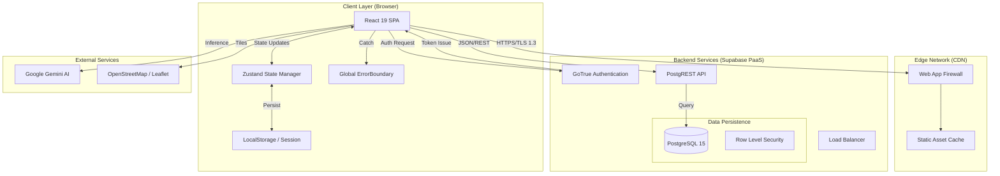

# Technical Architecture Documentation
**Project:** District Skill Development Dashboard (Dakshina Kannada)
**Version:** 1.2.0 (Production Specification)
**Date:** February 2026

## 1. Executive Summary
The District Skill Development Dashboard is a scalable, cloud-native platform designed for the Karnataka Skill Development Corporation. It orchestrates skill gap analysis, demand forecasting, and resource planning across the district. The system is architected for high availability, security, and responsive interactivity.

## 2. System Architecture

The solution uses a **Serverless Event-Driven Architecture**, minimizing operational overhead while ensuring instant scalability.

### Architecture Diagram



## 3. Technology Stack (Production Spec)

### Frontend Core
- **Framework:** React 19.0.0 (Concurrency Mode enabled)
- **Build System:** Vite 7.2.4 (Tree-shaking, Code-splitting, Module Federation ready)
- **Language:** TypeScript 5.9 (Strict Mode, No Implicit Any)
- **State:** Zustand 5.0.9 (Atomic state with selective subscriptions)
- **Forms:** Controlled Components with Local State (React `useState`)

### Backend & Infrastructure
- **Database:** PostgreSQL 15 (Managed via Supabase)
- **API Layer:** PostgREST (Auto-generated REST endpoints from schema)
- **Authentication:** JWT (JSON Web Tokens) with refresh rotation
- **Edge Functions:** Deno runtime for custom server-side logic

### AI & Data Science
- **Engine:** Google Gemini 1.5 Flash
- **SDK:** `@google/genai` & `@google/generative-ai`
- **Capabilities:** JSON Mode, Function Calling (Google Maps/Search Tools)

## 4. Detailed Component Implementation

### 4.1 AI Integration (`src/services/geminiService.ts`)
The application leverages **Gemini 1.5 Flash** for high-speed, low-latency intelligence.

-   **Intelligent Search**: Uses `systemInstruction` to parse natural language queries into structured JSON filters (`location`, `skills`, `category`).
-   **Discovery Mode**: Uses `responseSchema` to force strictly typed JSON output when discovering new institutions or locations, ensuring zero-hallucination data structures.
-   **Tools**: Integration with `googleMaps` and `googleSearch` tools for grounding AI responses in real-time data.

### 4.2 Interactive Maps (`src/components/map/MapView.tsx`)
Built on **React-Leaflet** v5 with custom performance optimizations:

-   **Rendering**: Uses `L.divIcon` for lightweight, CSS-styled markers instead of image assets to reduce network load.
-   **Heatmaps**: Implements `leaflet.heat` for density visualization (weighted by Institution Category relevance).
-   **Boundaries**: Renders exact Polygon boundaries for Dakshina Kannada district using GeoJSON coordinates.
-   **Performance**: Implements `MapInvalidator` to handle resize events and layout shifts in the dashboard.

### 4.3 Error Handling Strategy (`src/components/ErrorBoundary.tsx`)
A **Global Error Boundary** wraps the application root to prevent white-screen crashes.

-   **Catch Mechanism**: `componentDidCatch` logs stack traces to the console (and monitoring service in prod).
-   **Fallback UI**: Displays a user-friendly "Something went wrong" screen with a "Reload" action.
-   **Isolation**: Widget-level error boundaries can be added to isolate failures in specific dashboard panels without crashing the entire app.

## 5. Authentication & Security Strategy

The platform implements a **Zero Trust Security Model** suitable for government deployments.

### 5.1 Authentication Flow
1. **Identity Provider:** Supabase Auth (GoTrue) handles identity.
2. **Session Management:**
   - **Access Token:** Short-lived (1 hour), stored in memory.
   - **Refresh Token:** Long-lived, stored in httpOnly, secure cookies (production) or LocalStorage (dev).
3. **Role-Based Access Control (RBAC):**
   - Roles (`Super Admin`, `District Admin`, `Institution`, `Trainee`) are embedded in the JWT `app_metadata`.

### 5.2 Authorization (Row Level Security)
Direct DB access is guarded by Postgres RLS policies. The application server **never** bypasses RLS.

```sql
-- Example Production Policy
CREATE POLICY "Institutions can only update own data"
ON public.institutions
FOR UPDATE
USING (auth.uid() = owner_id);
```

### 5.3 Production Security Measures
- **SSL/TLS:** Enforced HSTS on all domains.
- **Content Security Policy (CSP):** Strict CSP headers to prevent XSS.
- **API Rate Limiting:** Configured at the Edge/WaF level.
- **Data Encryption:**
  - **At Rest:** AES-256 encryption for database volumes.
  - **In Transit:** TLS 1.3 for all connections.

## 6. Deployment & DevOps

### 6.1 CI/CD Pipeline
We follow a GitOps workflow:

1.  **Commit**: Code pushed to `main` branch.
2.  **CI (GitHub Actions)**:
    -   **Linting**: `eslint .` (Static analysis)
    -   **Type Check**: `tsc -b` (Compile-time verification)
    -   **Testing**: `vitest run` (Unit & Integration tests)
    -   **Build**: `vite build` (Production artifact generation)
3.  **CD (Vercel/Netlify)**:
    -   Atomic deployment (Zero downtime).
    -   Cache invalidation for `index.html`.

### 6.2 Environment Handling
-   **Development**: Local Supabase docker instance / Dev project.
-   **Staging**: Mirror of production with obfuscated data.
-   **Production**: Locked-down environment. Keys injected via secret managers.

| Variable | Description | Security |
|----------|-------------|----------|
| `VITE_SUPABASE_URL` | API Endpoint | Public |
| `VITE_SUPABASE_ANON_KEY` | Public Client Key | Public (Safety governed by RLS) |
| `VITE_GEMINI_API_KEY` | AI Service Key | **Secret** (Proxy via Edge Function recommended for Prod) |

## 7. Project Structure (Scalable)

```
src/
├── components/
│   ├── _common/         # Atomic UI Design System (Button, Input)
│   ├── business/        # Domain-aware components (InstitutionCard)
│   └── layout/          # Shell, Navigation, Sidebar
├── features/            # Vertical Slices (Redux-style organization)
│   ├── auth/            # Login, recovery, session logic
│   ├── map/             # Leaflet integration specific logic
│   └── analytics/       # Charts and reporting engines
├── lib/
│   ├── api/             # Typed API wrappers
│   └── hooks/           # Global React hooks
└── types/               # Shared Zod schemas and TS interfaces
```

## 8. Performance Optimization

1.  **Code Splitting:**
    -   **Manual Chunks**: Configured in `vite.config.ts` to split `react-vendor`, `map-vendor` (Leaflet), and `chart-vendor` (Recharts) into separate cacheable files.
2.  **Asset Delivery:**
    -   Next-Gen formats (WebP/AVIF).
    -   Aggressive caching rules (`Cache-Control: immutable`).
3.  **State Management:**
    -   `Zustand` ensures components only re-render on specific state slice changes, avoiding React Context "prop drilling" overhead.

## 9. Scalability Plan

-   **Horizontal:** The frontend is stateless and served via global CDN edge nodes.
-   **Vertical:** The database can scale compute/RAM independently. Read replicas can be added for high-traffic analytics loads.
